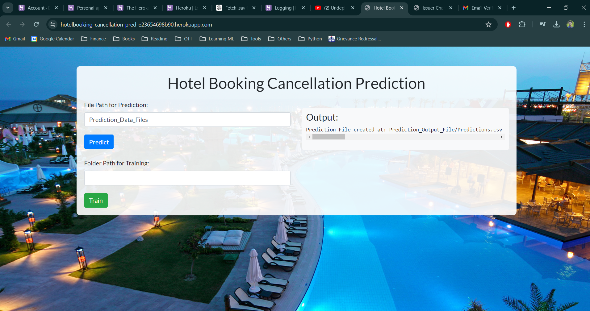

# Hotel Booking Cancellation Prediction



## Project Overview

This project aims to predict hotel booking cancellations using a dataset containing various features related to bookings. The model is built using Python and utilizes libraries such as Pandas, NumPy, and XGBoost for model prediction. The application is also deployed on Heroku for easy access.

## Data Description

The dataset contains the following features:

- **Booking_ID**: Unique identifier for booking
- **number of adults**: Number of adults included in the booking
- **number of children**: Number of children included in the booking
- **number of weekend nights**: Number of weekend nights included in the booking
- **number of week nights**: Number of week nights included in the booking
- **type of meal**: Type of meal included in the booking
- **car parking space**: Indicates whether a car parking space was requested or included in the booking
- **room type**: Type of room booked
- **lead time**: Number of days between the booking date and the arrival date
- **market segment type**: Type of market segment associated with the booking
- **repeated**: Indicates whether the booking is a repeat booking
- **P-C**: Number of previous bookings that were canceled by the customer prior to the current booking
- **P-not-C**: Number of previous bookings not canceled by the customer prior to the current booking
- **average price**: Average price associated with the booking
- **special requests**: Number of special requests made by the guest
- **date of reservation**: Date of the reservation
- **booking status**: Status of the booking (canceled or not canceled)

The target column is **'Booking Status'**, which indicates whether a booking is cancelled or not.

## Model and Libraries

- **Pandas**: Data manipulation and analysis
- **NumPy**: Numerical computations
- **XGBoost**: Model prediction

## Deployment

The application is deployed on Heroku and can be accessed via the following link: (The following link is fake concerning the costs)

[Hotel Booking Cancellation Prediction on Heroku](https://hotelbooking-cancellation-pred-e23654698b90.herokuapp.com/)

## Usage
### API Endpoints
#### Home
- URL: /
- Method: GET
- Description: Renders the home page

#### Predict
- URL: /predict
- Method: GET
- Description: Predicts the booking status for the provided data

#### Train
- URL: /train
- Method: POST
- Description: Trains the model with the provided data

## How to Run Locally

To run the Hotel Booking Cancellation Prediction project locally, follow these steps:

1. **Clone the repository**:

    ```sh
    git clone [https://github.com/your-username/hotel-booking-cancellation-prediction.git](https://github.com/BenRoshan100/Booking-Cancellation-Prediction.git)
    ```

2. **Navigate to the project directory**:

    ```sh
    cd hotel-booking-cancellation-prediction
    ```

3. **Install the required packages**:

    ```sh
    pip install -r requirements.txt
    ```

4. **Run the application**:

    ```sh
    python main.py
    ```

5. **Open your web browser and go to**:

    ```sh
    http://127.0.0.1:5000/
    ```

You should now be able to access the application locally and use its features for predicting hotel booking cancellations.

## License

This project is licensed under the personal License.

## Acknowledgments

- The dataset and inspiration for the project: [Hotel Booking Cancellation Prediction Dataset on Kaggle](https://www.kaggle.com/datasets/youssefaboelwafa/hotel-booking-cancellation-prediction)
- Python and its libraries:
  
- Pandas:
  
- NumPy:
  
- XGBoost:
  
- Flask for the web framework.
- iNeuron Institute for the data pipeline flow
- Heroku for hosting the application.

